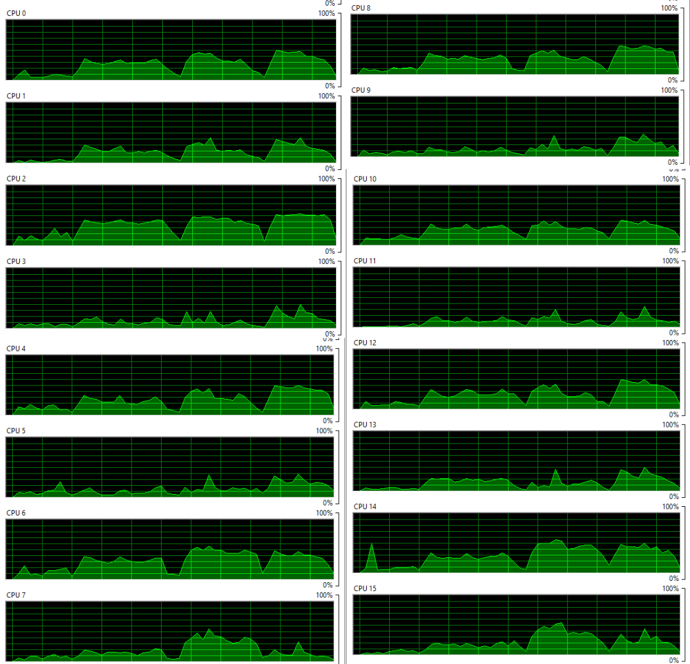
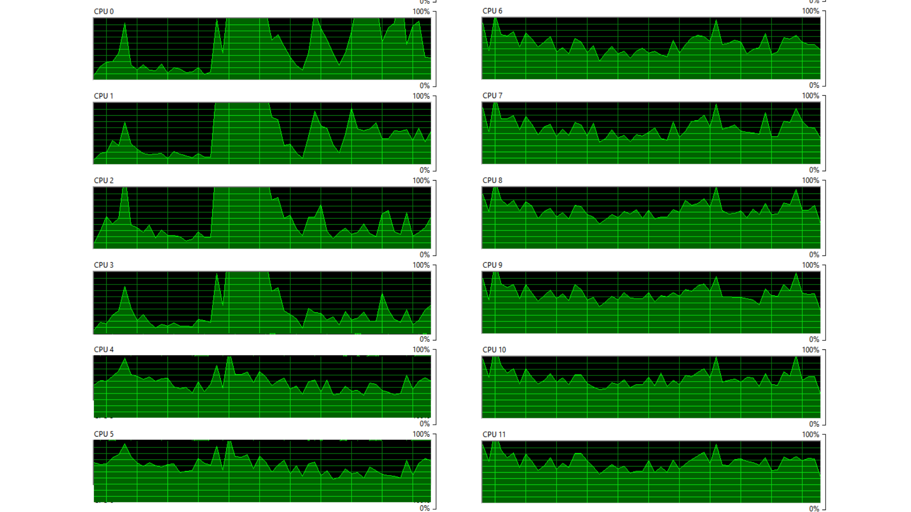

# Transformación de imágenes con OpenMP — Paralelización a nivel de tareas

## Descripción del problema
En esta actividad se aplicaron 6 transformaciones intensivas sobre tres imágenes de gran formato (superiores a 2000x2000 píxeles y 24 MB en formato `.bmp`), paralelizando el proceso a nivel de tareas con OpenMP usando *6, 12 y 18 threads*.

Las transformaciones aplicadas fueron:
1. Inversión horizontal en escala de grises
2. Inversión vertical en escala de grises
3. Desenfoque con kernel definido en escala de grises
4. Inversión horizontal a color
5. Inversión vertical a color
6. Desenfoque con kernel definido a color

Cada transformación por cada imagen se asignó como una tarea independiente (utilizando pragmas de concurrencia en bloques), permitiendo que los *threads* disponibles las ejecuten en paralelo (manejando un total de **18 tareas**).

---

## 1. Especificaciones de los equipos
*(Compañeros: Por favor agreguen su nombre y completen sus datos en la tabla)*

| Integrante | Sistema Operativo | Procesador | Cores | Threads Físicos | Frecuencia | RAM |
| :--- | :--- | :--- | :---: | :---: | :--- | :--- |
| **Daniel Flores** | macOS 15.6 | Apple M1 Pro | 8 | 8 | 3.22 GHz | 16 GB |
| **Ezio Saucedo** | Windows 11 Home 25H2 | 12th Gen i7-1255u | 10 | 12 | 1.70 GHz | 16 GB |
| **Kevin Núñez** | Linux (WSL sobre Windows 11) | AMD Ryzen 7 5800H | 8 | 16 | 3.2 – 4.4 GHz | 16 GB |

---

## 2. Resultados experimentales
Tiempo total de procesamiento de las 6 transformaciones sobre las 3 imágenes.

| Integrante | 6 threads (s) | 12 threads (s) | 18 threads (s) | Mejor configuración | Reducción |
| :--- | :---: | :---: | :---: | :---: | :---: |
| **Daniel Flores** | 4.388 | 4.174 | 4.310 | 12 threads | ~4.8% |
| **Ezio Saucedo** | 2.635 | 2.232 | 2.381 | 12 threads | ~15.3% |
| **Kevin Núñez** | 17.76 | 14.98 | 10.64 | 18 threads | ~40% |

---

## 3. Análisis por integrante

### Daniel Flores — Apple M1 Pro · macOS
El procesador M1 Pro cuenta con un máximo de 8 threads físicos (Apple Silicon no usa *Hyper-Threading*). Al ejecutar el programa:
* **Con 6 Threads (4.388 s):** Las 18 tareas se distribuyeron a lo largo de 6 de los 8 núcleos, despachándose de manera eficiente de 6 en 6.
* **Con 12 Threads (4.174 s):** Se obtiene la ligera mejoría del ~4.8% y resulta ser el punto óptimo. Esto se debe a que OpenMP exprime al 100% los **8 hilos físicos** usando todas las capacidades lógicas, logrando el mejor paso de las 18 instrucciones.
* **Con 18 Threads (4.310 s):** Surge un efecto de **sobresuscripción (over-subscription)**. Al imponer explícitamente 18 hilos sobre 8 núcleos reales, se presenta un esfuerzo adicional de gestión (*context-switching*) entre tantas variables sin un beneficio real. Sumado a esto, se presenta un cuello de botella de Entradas y Salidas (*I/O Bottleneck*) ya que el programa intenta enviar masivamente ~700 MB de imágenes al almacenamiento de estado sólido todos en franjas milisegundo idénticas, resultando en una degradación.

**Monitoreo del sistema — 6, 12 y 18 Threads (Daniel)**  
*(A continuación se muestran los picos de saturación total correspondientes a nuestras corridas ininterrumpidas de derecha a izquierda demostrando paralaje del 100%)*

### Kevin Núñez — AMD Ryzen 7 5800H · Linux (WSL sobre Windows 11)
El procesador cuenta con 8 núcleos físicos y 16 hilos lógicos mediante SMT, lo cual permite explotar paralelismo a nivel de tareas con OpenMP.
* **Con 6 Threads (17.76 s):** El rendimiento es el más bajo debido a una subutilización del hardware, ya que solo se aprovecha una parte de los hilos disponibles para ejecutar las 18 tareas.
* **Con 12 Threads (14.98 s):** Se observa una mejora significativa en el tiempo de ejecución al incrementar el paralelismo y distribuir más eficientemente las tareas entre los hilos disponibles.
* **Con 18 Threads (10.64 s):** Se alcanza el mejor rendimiento con una reducción cercana al 40%, ya que se logra ejecutar prácticamente todas las tareas en paralelo, aprovechando al máximo los recursos del sistema sin que el overhead afecte de forma crítica.

**Monitoreo del sistema — 6, 12 y 18 Threads (Kevin)**  
*(A continuación se muestran los picos de saturación total correspondientes a nuestras corridas ininterrumpidas de derecha a izquierda demostrando paralaje del 100%)*

### Ezio Saucedo — Intel Core i7-1255U · Windows 11 Home 25H2
El procesador Intel Core i7-1255U de 12ª generación cuenta con **10 núcleos** y **12 hilos lógicos**, por lo que ofrece un buen margen para paralelizar las 18 tareas del programa sin saturarse de inmediato. En mis resultados se observa que el mejor punto de ejecución fue con **12 threads**, que coincide con el total de hilos lógicos disponibles en el equipo.

* **Con 6 Threads (2.635 s):** El programa ya presenta un rendimiento alto, pero todavía existe una subutilización parcial del procesador, ya que solo se está ocupando la mitad de los hilos lógicos disponibles para repartir las 18 tareas.
* **Con 12 Threads (2.232 s):** Se obtiene el mejor tiempo, con una mejora aproximada del **15.3%** respecto a la corrida de 6 threads. En esta configuración OpenMP logra distribuir las tareas de forma más eficiente, aprovechando prácticamente toda la capacidad lógica del procesador.
* **Con 18 Threads (2.381 s):** Aunque el tiempo sigue siendo mejor que con 6 threads, ya se observa una ligera degradación respecto al punto óptimo. Esto sugiere un efecto de **sobresuscripción (over-subscription)**, ya que se están forzando más hilos de los que el procesador puede ejecutar de manera simultánea, lo que introduce overhead por planificación y cambios de contexto.

En conclusión, mi equipo escala bien al pasar de 6 a 12 threads, pero al subir a 18 threads el beneficio disminuye porque se rebasa el número de hilos lógicos disponibles. Por ello, la configuración más eficiente en este caso fue **12 threads**, al alinearse mejor con la arquitectura real del procesador.

**Monitoreo del sistema — 6, 12 y 18 Threads (Ezio)**  
*(A continuación se muestran los picos de saturación total correspondientes a nuestras corridas ininterrumpidas de derecha a izquierda demostrando paralaje del 100%)*

---

## 4. Comparativa general
*(Compañeros: Llenar tabla para ver la tendencia gráfica de todo el equipo)*

| Integrante | 6 threads (s) | 12 threads (s) | 18 threads (s) | Tendencia |
| :--- | :---: | :---: | :---: | :--- |
| **Daniel Flores** | 4.388 | 4.174 | 4.310 | ↘ Mejora leve pero luego ↑ Degrada |
| **Ezio Saucedo** | 2.635 | 2.232 | 2.381 | mejora progresiva al aumentar hilos, despues degrada|
| **Kevin Núñez** | 17.76 | 14.98 | 10.64 | Va mejorando linearmente |

---

## 5. Conclusión Global del Equipo

El comportamiento observado demuestra que la paralelización de múltiples tareas utilizando OpenMP posee beneficios escalonados hasta el tope físico de los ordenadores, revelando las siguientes limitantes:

1. **Topes Técnicos de Arquitectura:** Integrantes con equipos sin *Hyper-Threading* ven una degradación inminente al superar abrumadoramente el tope arquitectónico. Una sobresuscripción (*over-subscription*) genera tiempos planos o pequeñas caídas al agregar *overhead* computacional de manejo de memoria por cambio constante de contexto.
2. **Impacto por Lecto-Escritura (I/O Bottleneck):** En todos los casos con procesamiento de mega formato, generar sub-ramas exigentes sobre escritura en el disco duro transfiere el cuello de botella lejos de la CPU y directamente a la velocidad de la memoria sólida y su caché, neutralizando el poder de paralelización máxima que el lenguaje C alcanza.
3. Esto impacta directamente a la escalabilidad, pues el incrementar el numero de hilos no garantiza una mejora en el tiempo de ejecución. En algunos casos la ganancia fue moderada, mientras que en otros el aumento de threads produjo una mejora más marcada. Esto demuestra que el paralelismo tiene un límite práctico impuesto por la arquitectura y por el costo adicional de coordinación entre tareas.
4. La estrategia más inteligente radica en paralelizar sin desbordamiento lógico dictado en relación estrecha a los núcleos de cada respectiva máquina y no mediante aproximaciones en fuerza bruta.

En conjunto, los resultados del equipo muestran que OpenMP sí mejora el rendimiento del procesamiento de imágenes cuando la cantidad de hilos se ajusta de forma razonable a la capacidad del procesador. Sin embargo, también se comprobó que un aumento indiscriminado de threads puede generar saturación, sobrecarga administrativa y límites por entrada/salida. Por ello, la mejor estrategia no es maximizar hilos por fuerza bruta, sino encontrar el punto de equilibrio entre paralelismo, arquitectura del CPU y capacidad del sistema para mover grandes volúmenes de datos.