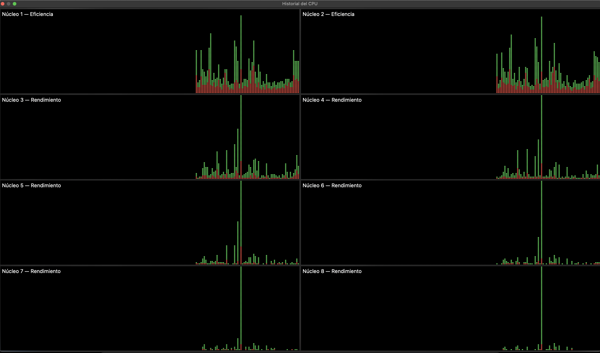

# Transformación de imágenes con OpenMP — Paralelización a nivel de tareas

## Descripción del problema
En esta actividad se aplicaron 6 transformaciones intensivas sobre tres imágenes de gran formato (superiores a 2000x2000 píxeles y 24 MB en formato `.bmp`), paralelizando el proceso a nivel de tareas con OpenMP usando *6, 12 y 18 threads*.

Las transformaciones aplicadas fueron:
1. Inversión horizontal en escala de grises
2. Inversión vertical en escala de grises
3. Desenfoque con kernel definido en escala de grises
4. Inversión horizontal a color
5. Inversión vertical a color
6. Desenfoque con kernel definido a color

Cada transformación por cada imagen se asignó como una tarea independiente (utilizando pragmas de concurrencia en bloques), permitiendo que los *threads* disponibles las ejecuten en paralelo (manejando un total de **18 tareas**).

---

## 1. Especificaciones de los equipos
*(Compañeros: Por favor agreguen su nombre y completen sus datos en la tabla)*

| Integrante | Sistema Operativo | Procesador | Cores | Threads Físicos | Frecuencia | RAM |
| :--- | :--- | :--- | :---: | :---: | :--- | :--- |
| **Daniel Flores** | macOS 15.6 | Apple M1 Pro | 8 | 8 | 3.22 GHz | 16 GB |
| **[Compañero 2]** | [OS] | [CPU] | [N] | [N] | [Freq] | [RAM] |
| **[Compañero 3]** | [OS] | [CPU] | [N] | [N] | [Freq] | [RAM] |

---

## 2. Resultados experimentales
Tiempo total de procesamiento de las 6 transformaciones sobre las 3 imágenes.

| Integrante | 6 threads (s) | 12 threads (s) | 18 threads (s) | Mejor configuración | Reducción |
| :--- | :---: | :---: | :---: | :---: | :---: |
| **Daniel Flores** | 4.388 | 4.174 | 4.310 | 12 threads | ~4.8% |
| **[Compañero 2]** | 0.00 | 0.00 | 0.00 | [Mejor config] | [ % ] |
| **[Compañero 3]** | 0.00 | 0.00 | 0.00 | [Mejor config] | [ % ] |

---

## 3. Análisis por integrante

### Daniel Flores — Apple M1 Pro · macOS
El procesador M1 Pro cuenta con un máximo de 8 threads físicos (Apple Silicon no usa *Hyper-Threading*). Al ejecutar el programa:
* **Con 6 Threads (4.388 s):** Las 18 tareas se distribuyeron a lo largo de 6 de los 8 núcleos, despachándose de manera eficiente de 6 en 6.
* **Con 12 Threads (4.174 s):** Se obtiene la ligera mejoría del ~4.8% y resulta ser el punto óptimo. Esto se debe a que OpenMP exprime al 100% los **8 hilos físicos** usando todas las capacidades lógicas, logrando el mejor paso de las 18 instrucciones.
* **Con 18 Threads (4.310 s):** Surge un efecto de **sobresuscripción (over-subscription)**. Al imponer explícitamente 18 hilos sobre 8 núcleos reales, se presenta un esfuerzo adicional de gestión (*context-switching*) entre tantas variables sin un beneficio real. Sumado a esto, se presenta un cuello de botella de Entradas y Salidas (*I/O Bottleneck*) ya que el programa intenta enviar masivamente ~700 MB de imágenes al almacenamiento de estado sólido todos en franjas milisegundo idénticas, resultando en una degradación.

**Monitoreo del sistema — 6, 12 y 18 Threads (Daniel)**  
*(A continuación se muestran los picos de saturación total correspondientes a nuestras corridas ininterrumpidas de derecha a izquierda demostrando paralaje del 100%)*

---

### [Nombre Compañero 2] — [Procesador] · [OS]
*(Compañero: Agrega aquí tu análisis observando tu propia imagen)*

**Monitoreo del sistema — 6 threads**

**Monitoreo del sistema — 12 threads**

**Monitoreo del sistema — 18 threads**

---

## 4. Comparativa general
*(Compañeros: Llenar tabla para ver la tendencia gráfica de todo el equipo)*

| Integrante | 6 threads (s) | 12 threads (s) | 18 threads (s) | Tendencia |
| :--- | :---: | :---: | :---: | :--- |
| **Daniel Flores** | 4.388 | 4.174 | 4.310 | ↘ Mejora leve pero luego ↑ Degrada |
| **[Compañero 2]** | 0.00 | 0.00 | 0.00 | [Tendencia] |
| **[Compañero 3]** | 0.00 | 0.00 | 0.00 | [Tendencia] |

---

## 5. Conclusión Global del Equipo
*(Borrador base, complementar para el momento de entrega cuando todos tengan tiempos)*

El comportamiento observado demuestra que la paralelización de múltiples tareas utilizando OpenMP posee beneficios escalonados hasta el tope físico de los ordenadores, revelando las siguientes limitantes:

1. **Topes Técnicos de Arquitectura:** Integrantes con equipos sin *Hyper-Threading* ven una degradación inminente al superar abrumadoramente el tope arquitectónico. Una sobresuscripción (*over-subscription*) genera tiempos planos o pequeñas caídas al agregar *overhead* computacional de manejo de memoria por cambio constante de contexto.
2. **Impacto por Lecto-Escritura (I/O Bottleneck):** En todos los casos con procesamiento de mega formato, generar sub-ramas exigentes sobre escritura en el disco duro transfiere el cuello de botella lejos de la CPU y directamente a la velocidad de la memoria sólida y su caché, neutralizando el poder de paralelización máxima que el lenguaje C alcanza.
3. La estrategia más inteligente radica en paralelizar sin desbordamiento lógico dictado en relación estrecha a los núcleos de cada respectiva máquina y no mediante aproximaciones en fuerza bruta.
